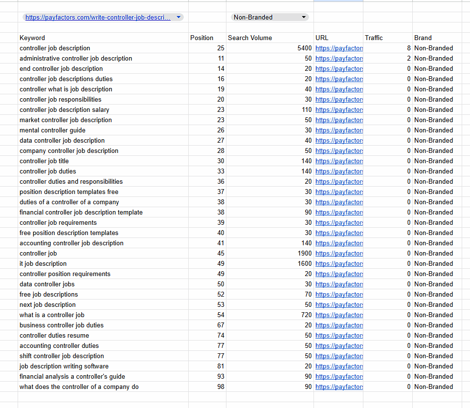

# README: SEO Keyword Analysis Spreadsheet

## Overview

This spreadsheet provides comprehensive SEO performance data for the Curocomp and Payfactors domains, helping to identify which URLs to keep, redirect, or allow to 404 based on their SEO value.

## Spreadsheet Structure

The spreadsheet contains the following key columns:

- **Keep?**: A "Y" or "N" recommendation based on the URL's performance
- **Notes**: Brief explanation for the recommendation
- **URL**: The full page URL being analyzed
- **Traffic (%)**: Percentage of total organic traffic this URL receives
- **Number of Keywords**: Count of keywords the URL ranks for
- **Traffic**: Estimated monthly visits from organic search
- **# of Unbranded KWs**: Number of non-brand keywords the URL ranks for

Additional data (separated in other sheets) includes:

- **Keyword**: The search term
- **Position**: Current ranking position in search results
- **Previous position**: Historical ranking for comparison
- **Search Volume**: Monthly search volume 
- **Keyword Difficulty**: SEO difficulty score (0-100)
- **CPC**: Cost-per-click value in paid search
- **SERP Features**: Special search result features present

## Query Tab Functionality

The spreadsheet includes a powerful "query" tab ([direct link](https://docs.google.com/spreadsheets/d/1VuYZAr1H6xKvp9uaPt9TAIb0UuIkFNXFy_VzqcCJChQ/edit?gid=362661428#gid=362661428)) that allows for dynamic analysis of URL performance:

  

- **Live URL Querying**: Select any URL from the dropdown to instantly see all keywords it's ranking for
- **Brand/Non-Brand Filtering**: Toggle between "Branded," "Non-Branded," or view all keywords
- **Performance Analysis**: View position, previous position, search volume, and traffic metrics for each keyword
- **Quick Assessment**: Easily identify which terms are driving branded vs. non-branded traffic to better understand organic value

This feature is particularly useful for:
1. Evaluating the true organic value of a page (by filtering to non-branded terms)
2. Identifying opportunities to optimize for specific keywords
3. Determining which pages have the strongest position for competitive terms
4. Assessing whether a page's traffic relies primarily on brand recognition or topical authority

## How to Use This Data

1. **Quick Assessment**: The "Keep?" column provides an immediate recommendation based on traffic value.
2. **Traffic Analysis**: Focus on URLs with highest Traffic (%) for priority optimization.
3. **Keyword Opportunities**: Look for high-volume keywords where current position is on page 2 (positions 11-20) for quick wins.
4. **Content Decisions**:
   - For "Y" URLs: Optimize and expand content
   - For "N" URLs: Either 301 redirect to relevant content or allow to 404
5. **Topic Clustering**: Identify keyword patterns to develop comprehensive content strategies
6. **Brand vs. Non-Brand Analysis**: Use the query tab to understand what percentage of traffic comes from branded terms

## Key Insights

- The LTIP page (https://blog.curocomp.com/long-term-incentive-plans) is the most valuable asset, driving ~75% of traffic
- Several job offer letter pages could be consolidated for better performance
- The David Goggins content drives significant traffic but has questionable business relevance
- The controller job description page has high opportunity value (5,400 monthly searches) but currently ranks on page 2-3

## Next Steps

Use these insights to develop a comprehensive content strategy that:
1. Preserves and strengthens high-performing content
2. Consolidates redundant pages
3. Creates targeted new content for high-opportunity keywords
4. Implements a disciplined technical SEO approach for pages with low value
5. Leverages the query tab to continually assess performance and identify new opportunities
